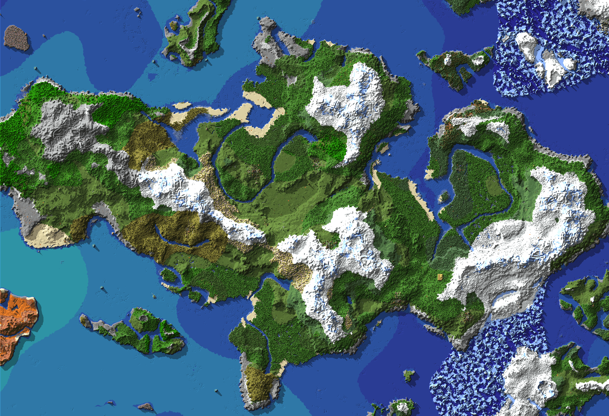

# Cartograph

Cartograph is a blazingly fast, high-efficiency 2D map renderer for Minecraft.



> *Compressed 16:1 Render*


## ✨ Features

- **Zero Dependencies**: 100% pure Go implementation.
- **Blazingly Fast**: Designed from the ground up to fully leverage Go's concurrency model. We parse region files and render maps in parallel using a bounded worker pool, ensuring we make full use of your CPU.
- **Memory Efficient**: Cartograph was designed to be very memory efficient, and predictable in its allocations. It is also able to operate under strict memory bounds. You can tune the worker count and max memory target to match your environment.
- **Accurate Top-Down Rendering**
  - Dynamic registry populated straight from the game files.
  - Accurate biome tinting, very little extra stylization.
  - 3D relief shading based on neighbour heights to convey the verticality/depth of your terrain.
- **Flexible Output**
  - In `composite` output mode, Cartograph generates a single large PNG of your world.
  - In `tiles` output mode, it outputs region-by-region image tiles.
  - Cartograph has built-in support for downsampling (`1:1`, `1:2`, `1:4`, `1:16`), giving you fine-grained control over the precision of the render (and the output file size).
- **Mod Resilience**
  - While Cartograph doesn't support mods **yet** (it certainly can in the future, the asset pipeline is already built), it can automatically handle unknown/modded blocks via deterministic colour generation to provide stable fallback colours.

## 🚀 Installation

Download the correct binary for your system from the latest release.

### Building from Source

Ensure you have [Go 1.24+](https://go.dev/dl/) installed.

Building from source is very straightforward:

```bash
git clone https://github.com/dsnidr/cartograph.git
cd cartograph
go build -o cartograph ./cmd/cartograph
```

Done! Copy and run `cartograph` wherever you wish.

## 🛠 Usage

By default, Cartograph will look for a world directory in your current working path. However, it is strongly recommended that you provide the `--world` flag to precisely specify which world you want to render.

```bash
# Render a composite map of the current directory's world
./cartograph

# Specify a world to render and an output file
./cartograph --world /path/to/world --out render.png

# Render a 25% scale thumbnail of your world
./cartograph --world /path/to/world --out thumbnail.png --scale 25%

# Render region tiles of your world
./cartograph --world /path/to/world --out-mode tiles --out-dir ./tiles

# Run with tuned memory constraints
./cartograph --world /path/to/world --max-memory 1G --workers 4
```

Run `cartograph help` for more usage info.

## 📄 License

This project is open-source under the MIT License.

## 🧠 Architecture Highlights (Nerd Stuff)

Cartograph uses a multi-stage concurrent pipeline to ensure maximum performance while avoiding out-of-memory (OOM) crashes.

1. **Discovery (stage 1)**: We begin by scanning your world's region folder, identifying any non-empty `.mca` region files.
2. **Parsing & Raycasting (stage 2)**: We unpack 1.18+ bit-packed integer arrays to locate block palettes, and drop a virtual ray (top-down) to build a map of heights, blocks, and biomes. We use this to build a heightmap for the next stage.
3. **Shading (stage 3)**: We compare boundary heights to apply North-West relief shading. This is done in a separate pass/stage to ensure it works across region boundaries. This is also the stage where we determine the final colour for each block (RGBA).
4. **Rendering**: Finally, we render the output to PNGs. This is done in a somewhat unusual way. Go's built-in `png` package doesn't fully take advantage of modern SIMD acceleration techniques, so it is quite slow out of the gate. I decided to vendor Go's `png` package (`internal/fastpng`) and swap out the compression package to use `klauspost/compress` which **does** take advantage of modern hardware improvements and is far faster. This swap sped up render times by over 5x for a 4000 block radius world.

### Performance Optimisations

Cartograph was heavily profiled and optimised to beat existing, established Minecraft renderers (like uNmInEd). To achieve faster Wall Times and drastically lower total CPU time, the following optimisations were implemented:

- **Zero-Allocation Pipeline:** We use bounded worker pools alongside aggressive `sync.Pool` usage to recycle `zlib.Reader`, `bufio.Reader`, block palettes, and massive `[]int64` NBT arrays. By allocating strictly within worker bounds and recycling memory, we effectively eliminated GC thrashing.
- **Zero-Alloc String Maps:** Instead of allocating temporary Go strings for millions of NBT tags, we use a `StringPool` that reads NBT byte spans directly into an interned map using `unsafe.String()`.
- **Targeted NBT Decoding:** Cartograph skips the heavy `encoding/json` or generic `map[string]interface{}` approaches. Instead, our custom NBT parser mathematically skips bytes corresponding to entities, inventories, and any other chunk data we don't need. This dramatically reduces I/O waits, memory consumption, and GC overhead.
- **Raycaster Fast-Paths:** Raycasting incorporates in-place section sorting and "transparent-only" section skipping. If a 16x16x16 chunk section is full of air or glass, the entire chunk section is bypassed without bit-shifting block indices.
- **SIMD-Accelerated PNG Encoding:** Standard library PNG encoding acts as a massive single-thread bottleneck. Cartograph vendors the `image/png` library (`internal/fastpng`) and dynamically swaps standard zlib for `klauspost/compress`. This leverages hardware-level SIMD instructions, unlocking massive concurrency throughput during the final output stage and shaving upwards of 10-15 seconds off large renders.

### Asset Ingestion

Instead of hardcoding colour maps that break every time Mojang changes something, Cartograph uses a custom `tools/ingest` program to read standard Minecraft client jar files. For each block, we determine the correct model, find the top face (if available), average the colour, and determine the transparency ratio.

We then store these colours and extracted biome data in compact JSONL files:
- `internal/registry/vanilla_colours.jsonl`
- `internal/registry/vanilla_biomes.jsonl`

These are included in all Cartograph builds. Updating it to new game versions is as simple as downloading the most recent client jar file and running the `tools/ingest` CLI against it. That's it.
